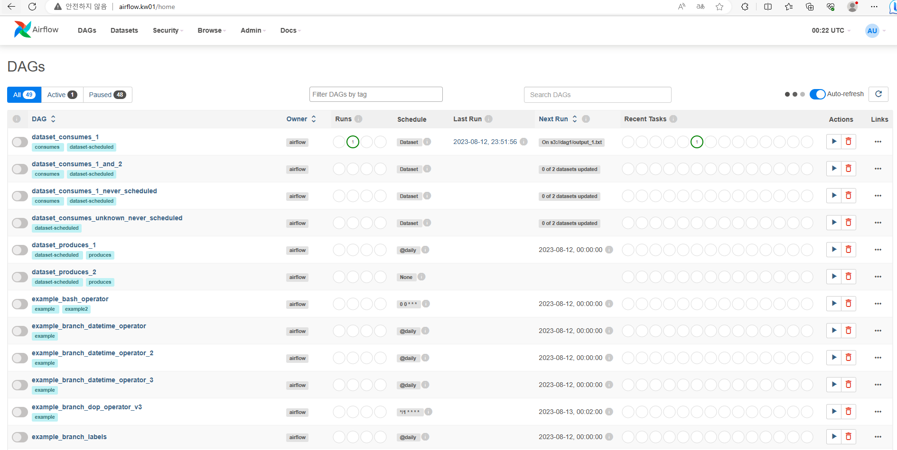

### Create k3s single node cluster

```bash

# SSH login to your VM and Run as root of VM to install airflow
curl -sfL https://get.k3s.io | sh -

```

### Install kubectl & helm

```bash
curl -LO "https://dl.k8s.io/release/$(curl -L -s https://dl.k8s.io/release/stable.txt)/bin/linux/amd64/kubectl"
chmod +x kubectl && mv kubectl /usr/local/bin
curl https://raw.githubusercontent.com/helm/helm/main/scripts/get-helm-3 | bash
```

### Check cluster access

```bash
# kubeconfig setup for your account
mkdir ~/.kube
cp /etc/rancher/k3s/k3s.yaml ~/.kube/config
# List all pods 
kubectl get pods -A

```

### Install airflow with examples

```bash

helm repo add apache-airflow https://airflow.apache.org
helm repo update
# install airflow with example in airflow namespace
helm upgrade -i airflow apache-airflow/airflow -n airflow --set-string "env[0].name=AIRFLOW__CORE__LOAD_EXAMPLES" --set-string "env[0].value=True" --create-namespace

```

### Create ingress to airflow webserver

```bash
# create airflow ingress to access from your browser
cat <<EOF | kubectl -n airflow apply -f -
apiVersion: networking.k8s.io/v1
kind: Ingress
metadata:
  name: airflow
spec:
  ingressClassName: traefik
  rules:
  - host: airflow.kw01
    http:
      paths:
      - path: /
        pathType: Prefix
        backend:
          service:
            name: airflow-webserver
            port:
              number: 8080
EOF

```

### Add hostname airflow.kw01 to your hosts file

```bash

# Windows/System32/drivers/etc/hosts or /etc/hosts
%VM_IP%          airflow.kw01

```

### Connect airflow with web browser

- http://airflow.kw01
- ID / PWD : admin / admin

---


