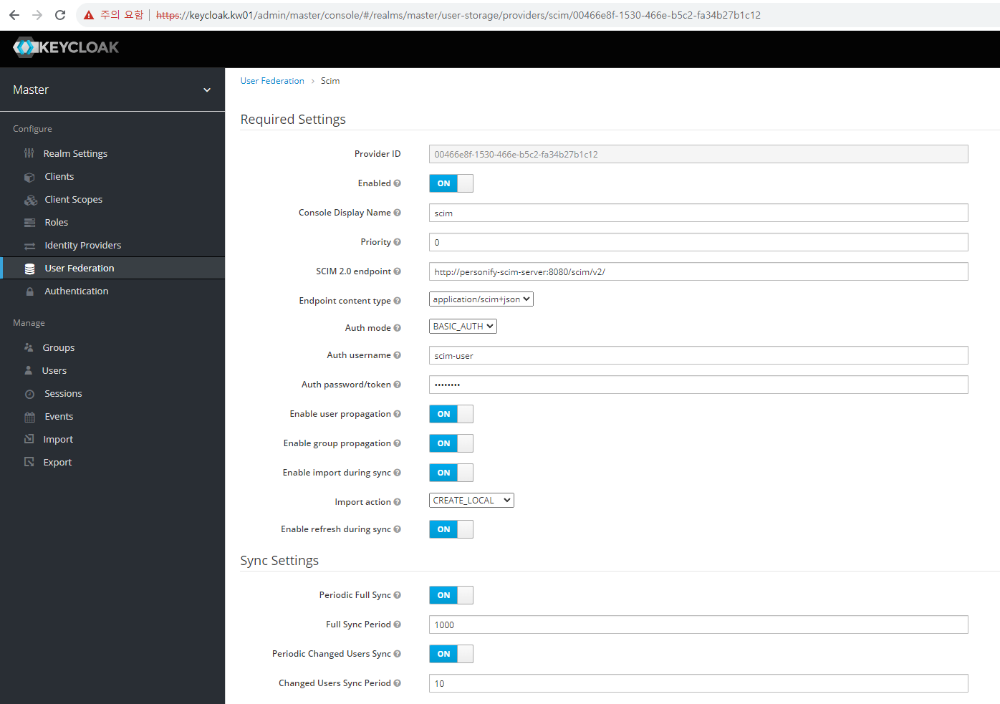

### Keycloak SCIM

- Install keycloak + SCIM server
- Install SCIM keycloak provider
- Create Users at SCIM server
- Keycloak SCIM federation setting and sync

[Keycloak + SCIM Install](manifests/keycloak-scim.yml)

```bash

k apply -f keycloak-scim.yml

# Dockerfile for air-gapped env

FROM quay.io/keycloak/keycloak:18.0.0
RUN  curl https://lab.libreho.st/libre.sh/scim/keycloak-scim/-/jobs/artifacts/main/raw/build/libs/keycloak-scim-1.0-SNAPSHOT-all.jar?job=package -Lo /opt/keycloak/providers/keycloak-scim-1.0-SNAPSHOT-all.jar


# Keycloak client config
https://lab.libreho.st/libre.sh/scim/keycloak-scim

http://personify-scim-server:8080/scim/v2
- Auth mode : BASIC_AUTH
- Enable refresh during sync : on


# SCIM create postman
https://bitbucket.org/wouter29/personify-scim-server/src/master/scim.postman_collection.json

```
---


